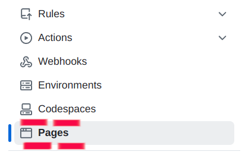

# How to create profile website in github
Github can host a website simple htm,css and javascript.Github renders a page name index.html.
We can add multiple page with tons of css,js in any numbers of page but need to linked with index.html.
Pages should be also in *.html extention.

# To create a profile website
### step 1 
  #### Go to settings page from user profile
  
### Step 2
  #### Select page from left menu
   
### Step 3
  #### Set a repository and its branch to render/deploy the website. We now recomend main branch for practice.
   
  
